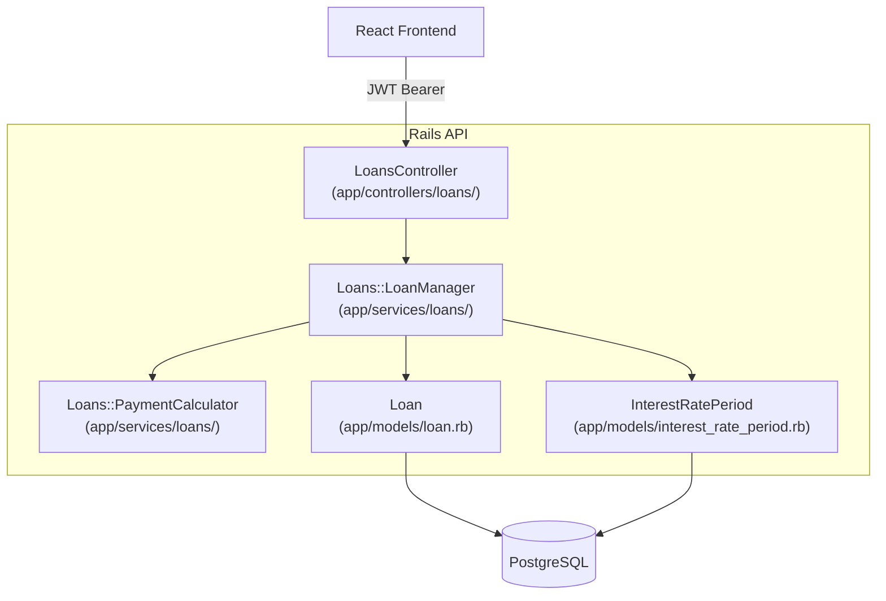

# Design Document: Loans Feature

## Overview

The Loans feature adds a loan-tracking domain to the personal finance management API. Authenticated users can create, read, update, and delete loan records. The system computes amortisation schedules and projected payoff dates on demand, supporting both fixed-rate and floating-rate loans.

All computation is performed server-side in a dedicated `Loans::PaymentCalculator` service. The Rails API exposes RESTful JSON endpoints consumed by the React frontend. Monetary values are stored and transmitted as integers in the smallest currency unit (e.g. paise for INR, cents for USD) to avoid floating-point rounding errors.

---

## Architecture

The feature follows the existing layered architecture:

- **Controllers** (`app/controllers/loans/`) — thin HTTP adapters; authenticate, delegate to services, render JSON
- **Models** (`app/models/`) — `Loan` and `InterestRatePeriod`; validations, associations, scopes only
- **Services** (`app/services/loans/`) — business logic in POROs:
  - `Loans::LoanManager` — CRUD orchestration
  - `Loans::PaymentCalculator` — amortisation, next-payment-date, dashboard summary
- **Database** — two new PostgreSQL tables: `loans` and `interest_rate_periods`



---

## Components and Interfaces

### LoansController

Namespace: `Loans::LoansController` (or a flat `LoansController` under `app/controllers/loans/`)

All actions call `authenticate_user!` before proceeding.

| Action    | Route                          | Description                                      |
|-----------|--------------------------------|--------------------------------------------------|
| `index`   | `GET /loans`                   | List all loans for the current user              |
| `show`    | `GET /loans/:id`               | Full loan detail with amortisation schedule      |
| `create`  | `POST /loans`                  | Create a new loan                                |
| `update`  | `PATCH /loans/:id`             | Update loan fields                               |
| `destroy` | `DELETE /loans/:id`            | Delete a loan and its rate periods               |

### InterestRatePeriodsController

Namespace: `Loans::InterestRatePeriodsController`

| Action    | Route                                              | Description                                      |
|-----------|----------------------------------------------------|--------------------------------------------------|
| `create`  | `POST /loans/:loan_id/interest_rate_periods`       | Add a rate period to a floating-rate loan        |
| `update`  | `PATCH /loans/:loan_id/interest_rate_periods/:id`  | Update an existing rate period                   |
| `destroy` | `DELETE /loans/:loan_id/interest_rate_periods/:id` | Remove a rate period                             |

### DashboardController (loans summary)

The existing (future) dashboard endpoint will call `Loans::PaymentCalculator.dashboard_summary(user)` to obtain the loans section.

### Loans::LoanManager

```ruby
# @param user [User]
# @param params [Hash]
# @return [Loan]
# @raise [Loans::LoanManager::ValidationError]
def self.create(user:, params:)

# @param user [User]
# @return [Array<Hash>] list items with computed next_payment_date and payoff_date
def self.list(user:)

# @param user [User]
# @param loan_id [Integer]
# @return [Hash] full loan detail with amortisation_schedule
# @raise [Loans::LoanManager::NotFoundError]
def self.show(user:, loan_id:)

# @param user [User]
# @param loan_id [Integer]
# @param params [Hash]
# @return [Loan]
# @raise [Loans::LoanManager::NotFoundError, Loans::LoanManager::ValidationError]
def self.update(user:, loan_id:, params:)

# @param user [User]
# @param loan_id [Integer]
# @return [void]
# @raise [Loans::LoanManager::NotFoundError]
def self.destroy(user:, loan_id:)

# @param user [User]
# @param loan_id [Integer]
# @param params [Hash]
# @return [Hash] updated loan with amortisation_schedule
# @raise [Loans::LoanManager::NotFoundError, Loans::LoanManager::ValidationError]
def self.add_or_update_rate_period(user:, loan_id:, params:)
```

Custom errors:
- `Loans::LoanManager::NotFoundError`
- `Loans::LoanManager::ValidationError`

### Loans::PaymentCalculator

```ruby
# @param loan [Loan]
# @return [Array<Hash>] amortisation schedule entries
def self.amortisation_schedule(loan)

# @param loan [Loan]
# @param as_of [Date] defaults to Date.today
# @return [Date]
def self.next_payment_date(loan, as_of: Date.today)

# @param loan [Loan]
# @return [Date, nil] projected payoff date, nil if schedule is empty
def self.payoff_date(loan)

# @param user [User]
# @return [Hash] { total_count:, total_outstanding_balance:, loans: [...] }
def self.dashboard_summary(user)
```

Each amortisation schedule entry is a plain Hash:

```ruby
{
  period:            Integer,   # 1-based period number
  payment_date:      Date,
  payment_amount:    Integer,   # smallest currency unit
  principal:         Integer,
  interest:          Integer,
  remaining_balance: Integer
}
```

---

## Data Models

### Loan

```ruby
# app/models/loan.rb
class Loan < ApplicationRecord
  belongs_to :user
  has_many :interest_rate_periods, dependent: :destroy

  INTEREST_RATE_TYPES = %w[fixed floating].freeze

  validates :institution_name,   presence: true
  validates :loan_identifier,    presence: true
  validates :outstanding_balance, numericality: { only_integer: true, greater_than: 0 }
  validates :annual_interest_rate, numericality: {
    greater_than_or_equal_to: 0,
    less_than_or_equal_to: 100
  }
  validates :interest_rate_type, inclusion: { in: INTEREST_RATE_TYPES }
  validates :monthly_payment,    numericality: { only_integer: true, greater_than: 0 }
  validates :payment_due_day,    numericality: {
    only_integer: true,
    greater_than_or_equal_to: 1,
    less_than_or_equal_to: 28
  }

  validate :floating_rate_requires_at_least_one_period, on: :create

  scope :for_user, ->(user) { where(user: user) }
end
```

**Migration — `loans` table:**

| Column                | Type      | Constraints                              |
|-----------------------|-----------|------------------------------------------|
| `id`                  | bigint    | PK                                       |
| `user_id`             | bigint    | NOT NULL, FK → users(id) ON DELETE CASCADE |
| `institution_name`    | string    | NOT NULL                                 |
| `loan_identifier`     | string    | NOT NULL                                 |
| `outstanding_balance` | bigint    | NOT NULL, CHECK > 0                      |
| `annual_interest_rate`| decimal(7,4) | NOT NULL, CHECK >= 0 AND <= 100       |
| `interest_rate_type`  | string    | NOT NULL, CHECK IN ('fixed','floating')  |
| `monthly_payment`     | bigint    | NOT NULL, CHECK > 0                      |
| `payment_due_day`     | integer   | NOT NULL, CHECK BETWEEN 1 AND 28         |
| `created_at`          | datetime  | NOT NULL                                 |
| `updated_at`          | datetime  | NOT NULL                                 |

Indexes: `index_loans_on_user_id`

### InterestRatePeriod

```ruby
# app/models/interest_rate_period.rb
class InterestRatePeriod < ApplicationRecord
  belongs_to :loan

  validates :start_date,          presence: true
  validates :annual_interest_rate, numericality: {
    greater_than_or_equal_to: 0,
    less_than_or_equal_to: 100
  }
  # end_date is nullable — nil means "open-ended / current period"
end
```

**Migration — `interest_rate_periods` table:**

| Column                | Type         | Constraints                                    |
|-----------------------|--------------|------------------------------------------------|
| `id`                  | bigint       | PK                                             |
| `loan_id`             | bigint       | NOT NULL, FK → loans(id) ON DELETE CASCADE     |
| `start_date`          | date         | NOT NULL                                       |
| `end_date`            | date         | nullable                                       |
| `annual_interest_rate`| decimal(7,4) | NOT NULL, CHECK >= 0 AND <= 100                |
| `created_at`          | datetime     | NOT NULL                                       |
| `updated_at`          | datetime     | NOT NULL                                       |

Indexes: `index_interest_rate_periods_on_loan_id`, `index_interest_rate_periods_on_loan_id_and_start_date`

### User (existing — additions only)

```ruby
has_many :loans, dependent: :destroy
```

---

## API Response Shapes

### Loan list item (GET /loans)

```json
{
  "id": 1,
  "institution_name": "HDFC Bank",
  "loan_identifier": "HL-2024-001",
  "outstanding_balance": 250000000,
  "interest_rate_type": "fixed",
  "annual_interest_rate": "8.5",
  "monthly_payment": 2500000,
  "next_payment_date": "2025-08-05",
  "payoff_date": "2032-03-05"
}
```

### Loan detail (GET /loans/:id)

```json
{
  "id": 1,
  "institution_name": "HDFC Bank",
  "loan_identifier": "HL-2024-001",
  "outstanding_balance": 250000000,
  "interest_rate_type": "fixed",
  "annual_interest_rate": "8.5",
  "monthly_payment": 2500000,
  "payment_due_day": 5,
  "next_payment_date": "2025-08-05",
  "payoff_date": "2032-03-05",
  "interest_rate_periods": [],
  "amortisation_schedule": [
    {
      "period": 1,
      "payment_date": "2025-08-05",
      "payment_amount": 2500000,
      "principal": 729167,
      "interest": 1770833,
      "remaining_balance": 249270833
    }
  ]
}
```

### Dashboard loans summary

```json
{
  "loans": {
    "total_count": 3,
    "total_outstanding_balance": 750000000,
    "items": [
      {
        "id": 1,
        "institution_name": "HDFC Bank",
        "outstanding_balance": 250000000,
        "next_payment_date": "2025-08-05"
      }
    ]
  }
}
```

---

## Amortisation Algorithm

### Fixed-rate

```
for each period n starting from 1:
  interest_n   = floor((balance_{n-1} × annual_rate / 100) / 12 + 0.5)   # round half-up
  principal_n  = monthly_payment − interest_n
  balance_n    = balance_{n-1} − principal_n

  if balance_n <= 0:
    # final period: adjust payment to exact remaining amount
    payment_n   = balance_{n-1} + interest_n
    principal_n = balance_{n-1}
    balance_n   = 0
    mark as payoff period; stop
```

### Floating-rate

Same algorithm, but `annual_rate` for period `n` is resolved by finding the `InterestRatePeriod` whose `start_date <= payment_date_n` and (`end_date >= payment_date_n` OR `end_date IS NULL`). If the payment date is beyond all defined periods, the most recent period's rate is used.

### Next payment date

```
if today.day < payment_due_day:
  return Date.new(today.year, today.month, payment_due_day)
else:
  next_month = today >> 1
  return Date.new(next_month.year, next_month.month, payment_due_day)
```

---

## Correctness Properties


*A property is a characteristic or behavior that should hold true across all valid executions of a system — essentially, a formal statement about what the system should do. Properties serve as the bridge between human-readable specifications and machine-verifiable correctness guarantees.*

### Property 1: Loan creation round-trip

*For any* valid set of loan creation parameters, creating a loan and then listing that user's loans SHALL result in the new loan appearing in the list with matching field values.

**Validates: Requirements 1.1, 2.1**

---

### Property 2: Invalid field values are rejected on create and update

*For any* loan params where at least one field violates a validation rule (outstanding_balance ≤ 0, annual_interest_rate outside [0, 100], or payment_due_day outside [1, 28]), the Loan_Manager SHALL reject the request with a 422 status.

**Validates: Requirements 1.3, 1.4, 1.5, 4.2**

---

### Property 3: User data isolation

*For any* two distinct users, a loan created by one user SHALL never appear in the other user's loan list or be accessible via the other user's show/update/delete requests.

**Validates: Requirements 2.4, 3.3, 4.3, 5.2**

---

### Property 4: Loan detail contains all required fields and a non-empty schedule

*For any* loan belonging to a user, fetching that loan by ID SHALL return a response containing all required fields (institution_name, loan_identifier, outstanding_balance, interest_rate_type, annual_interest_rate, monthly_payment, payment_due_day, next_payment_date, payoff_date, amortisation_schedule) and the amortisation_schedule SHALL be non-empty.

**Validates: Requirements 3.1, 2.2**

---

### Property 5: Loan deletion removes record and all rate periods

*For any* loan (with zero or more associated interest_rate_periods), deleting that loan SHALL result in neither the loan nor any of its interest_rate_periods being retrievable afterward.

**Validates: Requirements 5.1**

---

### Property 6: Per-period amortisation arithmetic invariant

*For any* fixed-rate loan and any non-final period in its amortisation schedule:
- `interest = round((previous_balance × annual_rate / 100) / 12)`
- `principal = payment_amount − interest`
- `remaining_balance = previous_balance − principal`

All three relationships SHALL hold simultaneously.

**Validates: Requirements 6.2, 6.3, 6.4**

---

### Property 7: Principal sum equals initial outstanding balance

*For any* loan (fixed-rate or floating-rate), the sum of all principal components across the full amortisation schedule SHALL equal the initial outstanding_balance within a tolerance of 1 smallest currency unit.

**Validates: Requirements 6.6, 7.4**

---

### Property 8: Final period has zero remaining balance

*For any* loan, the last entry in the amortisation schedule SHALL have a remaining_balance of zero.

**Validates: Requirements 6.5**

---

### Property 9: Floating-rate schedule uses correct rate per period

*For any* floating-rate loan with one or more interest_rate_periods, each entry in the amortisation schedule SHALL compute its interest component using the annual_interest_rate from the InterestRatePeriod whose date range covers that entry's payment_date. For payment dates beyond all defined periods, the most recent period's rate SHALL be used.

**Validates: Requirements 7.1, 7.2**

---

### Property 10: Next payment date is always in the future and on the correct day

*For any* loan and any reference date, the computed next_payment_date SHALL satisfy:
- `next_payment_date.day == loan.payment_due_day`
- `next_payment_date > reference_date`
- If `reference_date.day < payment_due_day`, the result is in the same calendar month as reference_date; otherwise it is in the following calendar month.

**Validates: Requirements 9.1, 9.2, 9.3**

---

### Property 11: Dashboard summary totals are consistent with actual loans

*For any* user with N loans having known outstanding balances, the dashboard loans summary SHALL return `total_count == N` and `total_outstanding_balance == sum of all outstanding_balances`, and the items array SHALL contain exactly N entries each with the required fields (id, institution_name, outstanding_balance, next_payment_date).

**Validates: Requirements 10.1, 10.2**

---

## Error Handling

### Validation errors (422 Unprocessable Entity)

Returned when model validations fail. Response shape:

```json
{
  "error": "validation_failed",
  "message": "Outstanding balance must be greater than 0",
  "details": {
    "outstanding_balance": ["must be greater than 0"]
  }
}
```

The `details` key maps field names to arrays of error messages, matching Rails' `model.errors.as_json`.

### Not found (404)

Returned when a loan ID does not exist or belongs to another user. The response intentionally does not distinguish between "not found" and "forbidden" to avoid leaking resource existence.

```json
{
  "error": "not_found",
  "message": "Loan not found"
}
```

### Unauthenticated (401)

Handled by the existing `authenticate_user!` in `ApplicationController`. No additional handling needed in loan controllers.

### Business rule violations (422)

- Attempting to add an `InterestRatePeriod` to a fixed-rate loan returns 422 with `error: "invalid_operation"`.
- Floating-rate loan created without at least one rate period returns 422 with `error: "validation_failed"`.

### Edge cases in calculation

- If `monthly_payment <= interest` for any period (i.e. the loan would never be paid off), the `PaymentCalculator` SHALL raise `Loans::PaymentCalculator::NonConvergingLoanError`. The controller catches this and returns 422 with `error: "non_converging_loan"` and a descriptive message.
- The calculator caps the schedule at 600 periods (50 years) as a safety guard against infinite loops.

---

## Frontend Design

### Overview

The frontend is a React + TypeScript + Vite application using shadcn/ui components, Tailwind CSS, react-router-dom v7, react-hook-form, and zod. It follows the existing patterns established by the auth and dashboard features.

### Frontend Architecture

```
frontend/src/
├── api/
│   └── loansApi.ts              # Typed fetch wrappers for all loans endpoints
├── hooks/
│   └── useLoans.ts              # State management hook for loans data
├── pages/
│   ├── LoansPage.tsx            # Loans list page (replaces mock-data stub)
│   └── LoanDetailPage.tsx       # Loan detail + amortisation schedule page
└── components/
    └── loans/
        ├── AddLoanDialog.tsx    # Create loan form dialog
        ├── EditLoanDialog.tsx   # Edit loan form dialog
        ├── LoanFormFields.tsx   # Shared form fields (used by Add and Edit)
        └── AmortisationTable.tsx # Amortisation schedule table
```

### API Layer — `loansApi.ts`

Follows the same pattern as `authApi.ts`: typed request/response interfaces, a shared `request<T>()` helper, and a `LoansApiError` class.

```typescript
// Types
interface Loan { id: number; institution_name: string; loan_identifier: string;
  outstanding_balance: number; interest_rate_type: 'fixed' | 'floating';
  annual_interest_rate: string; monthly_payment: number; payment_due_day: number;
  next_payment_date: string; payoff_date: string; }

interface AmortisationEntry { period: number; payment_date: string;
  payment_amount: number; principal: number; interest: number; remaining_balance: number; }

interface LoanDetail extends Loan {
  interest_rate_periods: InterestRatePeriod[];
  amortisation_schedule: AmortisationEntry[]; }

interface InterestRatePeriod { id: number; start_date: string;
  end_date: string | null; annual_interest_rate: string; }

interface DashboardLoansSummary { total_count: number;
  total_outstanding_balance: number; items: DashboardLoanItem[]; }

// Functions
function listLoans(token: string): Promise<Loan[]>
function getLoan(token: string, id: number): Promise<LoanDetail>
function createLoan(token: string, params: CreateLoanParams): Promise<LoanDetail>
function updateLoan(token: string, id: number, params: UpdateLoanParams): Promise<LoanDetail>
function deleteLoan(token: string, id: number): Promise<void>
function createRatePeriod(token: string, loanId: number, params: RatePeriodParams): Promise<LoanDetail>
function updateRatePeriod(token: string, loanId: number, periodId: number, params: RatePeriodParams): Promise<LoanDetail>
function deleteRatePeriod(token: string, loanId: number, periodId: number): Promise<void>
```

### State Hook — `useLoans.ts`

```typescript
interface UseLoansReturn {
  loans: Loan[];
  isLoading: boolean;
  error: string | null;
  createLoan(params: CreateLoanParams): Promise<void>;
  deleteLoan(id: number): Promise<void>;
  refresh(): Promise<void>;
}

function useLoans(): UseLoansReturn

interface UseLoanDetailReturn {
  loan: LoanDetail | null;
  isLoading: boolean;
  error: string | null;
  updateLoan(params: UpdateLoanParams): Promise<void>;
  deleteLoan(): Promise<void>;
  addRatePeriod(params: RatePeriodParams): Promise<void>;
  updateRatePeriod(periodId: number, params: RatePeriodParams): Promise<void>;
  deleteRatePeriod(periodId: number): Promise<void>;
  refresh(): Promise<void>;
}

function useLoanDetail(id: number): UseLoanDetailReturn
```

### Routing

Add `/loans/:id` route to `App.tsx`:

```tsx
<Route path="/loans" element={<LoansPage />} />
<Route path="/loans/:id" element={<LoanDetailPage />} />
```

### Form Validation Schema (zod)

```typescript
const loanSchema = z.object({
  institution_name: z.string().min(1, 'Required'),
  loan_identifier: z.string().min(1, 'Required'),
  outstanding_balance: z.number().int().positive('Must be greater than 0'),
  annual_interest_rate: z.number().min(0).max(100),
  interest_rate_type: z.enum(['fixed', 'floating']),
  monthly_payment: z.number().int().positive('Must be greater than 0'),
  payment_due_day: z.number().int().min(1).max(28),
  // Required when interest_rate_type === 'floating'
  interest_rate_periods: z.array(ratePeriodSchema).optional(),
});
```

### Currency Display

Outstanding balance and payment amounts are stored as integers (smallest currency unit — paise). Display helper:

```typescript
// Converts paise to rupees and formats with ₹ symbol
function formatCurrency(paise: number): string {
  return `₹${(paise / 100).toLocaleString('en-IN', { minimumFractionDigits: 2 })}`;
}
```

### Loading and Error States

- Loading: shadcn `Skeleton` components matching the shape of the content being loaded
- API errors: displayed via the existing `useToast` hook (toast notifications for non-field errors)
- Validation errors: inline below each field using the `FormField` wrapper component

---

## Testing Strategy

### Dual testing approach

Unit/example tests cover specific scenarios, edge cases, and integration points. Property-based tests verify universal invariants across randomly generated inputs.

### Property-based testing library

Use **[rantly](https://github.com/rantly-rb/rantly)** — the established Ruby PBT library compatible with RSpec. Each property test runs a minimum of **100 iterations**.

Property tests live under `backend/spec/properties/loans/`.

Tag format for each property test:
```ruby
# Feature: loans, Property N: <property_text>
```

### Unit / example tests

Located under `backend/spec/`:

| File | Coverage |
|------|----------|
| `spec/models/loan_spec.rb` | Validations, associations |
| `spec/models/interest_rate_period_spec.rb` | Validations, associations |
| `spec/services/loans/loan_manager_spec.rb` | CRUD, auth enforcement, 404/422 cases |
| `spec/services/loans/payment_calculator_spec.rb` | Fixed/floating schedule examples, next-payment-date branches, edge cases |
| `spec/requests/loans/loans_spec.rb` | Request-level integration: auth, routing, response shapes |
| `spec/requests/loans/interest_rate_periods_spec.rb` | Rate period CRUD, fixed-rate rejection |

Key example-based scenarios:
- Floating-rate loan created without rate periods → 422
- Adding rate period to fixed-rate loan → 422
- User A accessing User B's loan → 404
- Unauthenticated requests → 401
- User with no loans → empty list, dashboard zeros
- Non-converging loan (payment ≤ interest) → 422

### Property tests

| File | Properties covered |
|------|--------------------|
| `spec/properties/loans/loan_crud_properties_spec.rb` | Properties 1, 2, 3, 4, 5 |
| `spec/properties/loans/payment_calculator_properties_spec.rb` | Properties 6, 7, 8, 9, 10 |
| `spec/properties/loans/dashboard_properties_spec.rb` | Property 11 |

### Test data conventions

Following project conventions, helper methods (`valid_loan_attrs`, `create_loan`, `create_floating_loan`, etc.) are defined at the top of each spec file — no shared factories.

`freeze_time` is used in all tests involving `next_payment_date` or `payoff_date` computation.
