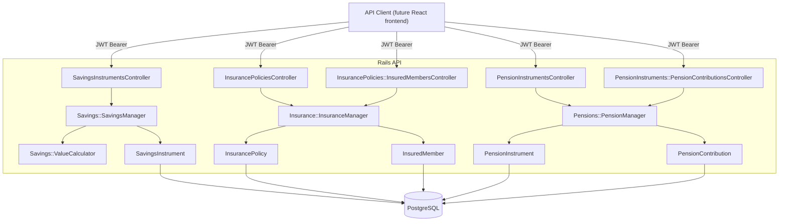

# Design Document: Savings, Insurance, and Pensions Feature

## Overview

The Savings, Insurance, and Pensions feature extends the personal finance management API with three new tracking domains. Authenticated users can record and monitor savings instruments (Fixed Deposits, Recurring Deposits, and similar), insurance policies (term, health, auto, bike), and pension instruments (EPF, NPS, and similar).

The system computes projected maturity values for savings instruments using compound interest, generates projected contribution schedules for recurring savings, tracks renewal dates for insurance policies, and aggregates contribution history for pension instruments. All three domains are surfaced on the Dashboard alongside the existing Loans summary.

This feature covers the backend Rails API only; the React frontend is not yet scaffolded. All monetary values are stored and transmitted as integers in the smallest currency unit (paise) to avoid floating-point rounding errors.

---

## Architecture

The feature follows the same layered architecture established by the Loans feature:

- **Controllers** (`app/controllers/`) — thin HTTP adapters; authenticate, delegate to services, render JSON
- **Models** (`app/models/`) — `SavingsInstrument`, `InsurancePolicy`, `InsuredMember`, `PensionInstrument`, `PensionContribution`; validations, associations, scopes only
- **Services** (`app/services/`) — business logic in POROs:
  - `Savings::SavingsManager` — CRUD orchestration for savings instruments
  - `Savings::ValueCalculator` — maturity value projection and recurring schedule computation
  - `Insurance::InsuranceManager` — CRUD orchestration for insurance policies and insured members
  - `Pensions::PensionManager` — CRUD orchestration for pension instruments and contributions
- **Database** — five new PostgreSQL tables: `savings_instruments`, `insurance_policies`, `insured_members`, `pension_instruments`, `pension_contributions`



---

## Components and Interfaces

### SavingsInstrumentsController

All actions call `authenticate_user!` before proceeding.

| Action    | Route                              | Description                                              |
|-----------|------------------------------------|----------------------------------------------------------|
| `index`   | `GET /savings_instruments`         | List all savings instruments for the current user        |
| `show`    | `GET /savings_instruments/:id`     | Full detail with maturity value and optional schedule    |
| `create`  | `POST /savings_instruments`        | Create a new savings instrument                          |
| `update`  | `PATCH /savings_instruments/:id`   | Update savings instrument fields                         |
| `destroy` | `DELETE /savings_instruments/:id`  | Delete a savings instrument                              |

### InsurancePoliciesController

All actions call `authenticate_user!` before proceeding.

| Action    | Route                              | Description                                              |
|-----------|------------------------------------|----------------------------------------------------------|
| `index`   | `GET /insurance_policies`          | List all insurance policies for the current user         |
| `show`    | `GET /insurance_policies/:id`      | Full detail including insured members                    |
| `create`  | `POST /insurance_policies`         | Create a new insurance policy                            |
| `update`  | `PATCH /insurance_policies/:id`    | Update insurance policy fields                           |
| `destroy` | `DELETE /insurance_policies/:id`   | Delete a policy and all its insured members              |

### InsurancePolicies::InsuredMembersController

| Action    | Route                                                          | Description                          |
|-----------|----------------------------------------------------------------|--------------------------------------|
| `create`  | `POST /insurance_policies/:policy_id/insured_members`          | Add an insured member to a policy    |
| `update`  | `PATCH /insurance_policies/:policy_id/insured_members/:id`     | Update an insured member             |
| `destroy` | `DELETE /insurance_policies/:policy_id/insured_members/:id`    | Remove an insured member             |

### PensionInstrumentsController

All actions call `authenticate_user!` before proceeding.

| Action    | Route                               | Description                                              |
|-----------|-------------------------------------|----------------------------------------------------------|
| `index`   | `GET /pension_instruments`          | List all pension instruments for the current user        |
| `show`    | `GET /pension_instruments/:id`      | Full detail with contribution history and total corpus   |
| `create`  | `POST /pension_instruments`         | Create a new pension instrument                          |
| `update`  | `PATCH /pension_instruments/:id`    | Update pension instrument fields                         |
| `destroy` | `DELETE /pension_instruments/:id`   | Delete a pension instrument and all its contributions    |

### PensionInstruments::PensionContributionsController

| Action    | Route                                                                  | Description                              |
|-----------|------------------------------------------------------------------------|------------------------------------------|
| `create`  | `POST /pension_instruments/:instrument_id/pension_contributions`       | Record a new contribution                |
| `update`  | `PATCH /pension_instruments/:instrument_id/pension_contributions/:id`  | Update a contribution record             |
| `destroy` | `DELETE /pension_instruments/:instrument_id/pension_contributions/:id` | Delete a contribution record             |

### Savings::SavingsManager

```ruby
# @param user [User]
# @param params [Hash]
# @return [SavingsInstrument]
# @raise [Savings::SavingsManager::ValidationError]
def self.create(user:, params:)

# @param user [User]
# @return [Array<Hash>] list items with computed maturity_value
def self.list(user:)

# @param user [User]
# @param instrument_id [Integer]
# @return [Hash] full detail with maturity_value and optional payment_schedule
# @raise [Savings::SavingsManager::NotFoundError]
def self.show(user:, instrument_id:)

# @param user [User]
# @param instrument_id [Integer]
# @param params [Hash]
# @return [SavingsInstrument]
# @raise [Savings::SavingsManager::NotFoundError, Savings::SavingsManager::ValidationError]
def self.update(user:, instrument_id:, params:)

# @param user [User]
# @param instrument_id [Integer]
# @return [nil]
# @raise [Savings::SavingsManager::NotFoundError]
def self.destroy(user:, instrument_id:)

# @param user [User]
# @return [Hash] { total_count:, total_principal:, items: [...] }
def self.dashboard_summary(user)
```

Custom errors:
- `Savings::SavingsManager::NotFoundError`
- `Savings::SavingsManager::ValidationError`

### Savings::ValueCalculator

```ruby
# Computes the projected maturity value using compound interest.
# Returns principal_amount when no maturity_date is present.
#
# @param instrument [SavingsInstrument]
# @param compounding_frequency [Integer] defaults to 4 (quarterly)
# @return [Integer] maturity value in smallest currency unit
def self.maturity_value(instrument, compounding_frequency: 4)

# Generates the projected contribution schedule for recurring savings instruments.
# Returns an empty array when no maturity_date is present.
#
# @param instrument [SavingsInstrument]
# @return [Array<Hash>] schedule entries
def self.payment_schedule(instrument)

# Returns the next contribution date for a recurring savings instrument.
#
# @param instrument [SavingsInstrument]
# @param as_of [Date] defaults to Date.today
# @return [Date]
def self.next_contribution_date(instrument, as_of: Date.today)
```

Each payment schedule entry is a plain Hash:

```ruby
{
  contribution_date:   Date,
  contribution_amount: Integer,  # recurring_amount in smallest currency unit
  running_total:       Integer   # cumulative sum of all contributions to this point
}
```

### Insurance::InsuranceManager

```ruby
# @param user [User]
# @param params [Hash]
# @return [InsurancePolicy]
# @raise [Insurance::InsuranceManager::ValidationError]
def self.create(user:, params:)

# @param user [User]
# @return [Array<Hash>] list items
def self.list(user:)

# @param user [User]
# @param policy_id [Integer]
# @return [Hash] full detail with insured_members
# @raise [Insurance::InsuranceManager::NotFoundError]
def self.show(user:, policy_id:)

# @param user [User]
# @param policy_id [Integer]
# @param params [Hash]
# @return [InsurancePolicy]
# @raise [Insurance::InsuranceManager::NotFoundError, Insurance::InsuranceManager::ValidationError]
def self.update(user:, policy_id:, params:)

# @param user [User]
# @param policy_id [Integer]
# @return [nil]
# @raise [Insurance::InsuranceManager::NotFoundError]
def self.destroy(user:, policy_id:)

# @param user [User]
# @param policy_id [Integer]
# @param params [Hash]
# @return [Hash] updated policy detail
# @raise [Insurance::InsuranceManager::NotFoundError, Insurance::InsuranceManager::ValidationError]
def self.add_or_update_member(user:, policy_id:, params:)

# @param user [User]
# @param policy_id [Integer]
# @param member_id [Integer]
# @return [Hash] updated policy detail
# @raise [Insurance::InsuranceManager::NotFoundError]
def self.remove_member(user:, policy_id:, member_id:)

# @param user [User]
# @return [Hash] { total_count:, items: [...] }
def self.dashboard_summary(user)
```

Custom errors:
- `Insurance::InsuranceManager::NotFoundError`
- `Insurance::InsuranceManager::ValidationError`

### Pensions::PensionManager

```ruby
# @param user [User]
# @param params [Hash]
# @return [PensionInstrument]
# @raise [Pensions::PensionManager::ValidationError]
def self.create(user:, params:)

# @param user [User]
# @return [Array<Hash>] list items with total_corpus
def self.list(user:)

# @param user [User]
# @param instrument_id [Integer]
# @return [Hash] full detail with contributions and total_corpus
# @raise [Pensions::PensionManager::NotFoundError]
def self.show(user:, instrument_id:)

# @param user [User]
# @param instrument_id [Integer]
# @param params [Hash]
# @return [PensionInstrument]
# @raise [Pensions::PensionManager::NotFoundError, Pensions::PensionManager::ValidationError]
def self.update(user:, instrument_id:, params:)

# @param user [User]
# @param instrument_id [Integer]
# @return [nil]
# @raise [Pensions::PensionManager::NotFoundError]
def self.destroy(user:, instrument_id:)

# @param user [User]
# @param instrument_id [Integer]
# @param params [Hash]
# @return [Hash] updated instrument detail
# @raise [Pensions::PensionManager::NotFoundError, Pensions::PensionManager::ValidationError]
def self.add_contribution(user:, instrument_id:, params:)

# @param user [User]
# @param instrument_id [Integer]
# @param contribution_id [Integer]
# @param params [Hash]
# @return [Hash] updated instrument detail
# @raise [Pensions::PensionManager::NotFoundError, Pensions::PensionManager::ValidationError]
def self.update_contribution(user:, instrument_id:, contribution_id:, params:)

# @param user [User]
# @param instrument_id [Integer]
# @param contribution_id [Integer]
# @return [Hash] updated instrument detail
# @raise [Pensions::PensionManager::NotFoundError]
def self.remove_contribution(user:, instrument_id:, contribution_id:)

# @param user [User]
# @return [Hash] { total_count:, total_corpus:, items: [...] }
def self.dashboard_summary(user)
```

Custom errors:
- `Pensions::PensionManager::NotFoundError`
- `Pensions::PensionManager::ValidationError`

---

## Data Models

### SavingsInstrument

```ruby
# app/models/savings_instrument.rb
class SavingsInstrument < ApplicationRecord
  belongs_to :user

  SAVINGS_TYPES = %w[fd rd other].freeze
  CONTRIBUTION_FREQUENCIES = %w[one_time monthly quarterly annually].freeze

  validates :institution_name,      presence: true
  validates :savings_identifier,    presence: true
  validates :savings_type,          inclusion: { in: SAVINGS_TYPES }
  validates :principal_amount,      numericality: { only_integer: true, greater_than: 0 }
  validates :annual_interest_rate,  numericality: {
    greater_than_or_equal_to: 0,
    less_than_or_equal_to: 100
  }
  validates :contribution_frequency, inclusion: { in: CONTRIBUTION_FREQUENCIES }
  validates :start_date,            presence: true
  validates :recurring_amount,      numericality: { only_integer: true, greater_than: 0 },
                                    allow_nil: true

  validate :recurring_amount_required_for_non_one_time
  validate :maturity_date_after_start_date

  scope :for_user, ->(user) { where(user: user) }

  private

  def recurring_amount_required_for_non_one_time
    return if contribution_frequency == "one_time"
    return if recurring_amount.present?
    errors.add(:recurring_amount, "is required when contribution frequency is not one_time")
  end

  def maturity_date_after_start_date
    return unless maturity_date.present? && start_date.present?
    return if maturity_date > start_date
    errors.add(:maturity_date, "must be after the start date")
  end
end
```

**Migration — `savings_instruments` table:**

| Column                  | Type         | Constraints                                                                    |
|-------------------------|--------------|--------------------------------------------------------------------------------|
| `id`                    | bigint       | PK                                                                             |
| `user_id`               | bigint       | NOT NULL, FK → users(id) ON DELETE CASCADE                                     |
| `institution_name`      | string       | NOT NULL                                                                       |
| `savings_identifier`    | string       | NOT NULL                                                                       |
| `savings_type`          | string       | NOT NULL, CHECK IN ('fd','rd','other')                                         |
| `principal_amount`      | bigint       | NOT NULL, CHECK > 0                                                            |
| `annual_interest_rate`  | decimal(7,4) | NOT NULL, CHECK >= 0 AND <= 100                                                |
| `contribution_frequency`| string       | NOT NULL, CHECK IN ('one_time','monthly','quarterly','annually')               |
| `start_date`            | date         | NOT NULL                                                                       |
| `maturity_date`         | date         | nullable                                                                       |
| `recurring_amount`      | bigint       | nullable, CHECK > 0 (enforced at model layer)                                  |
| `notes`                 | text         | nullable                                                                       |
| `created_at`            | datetime     | NOT NULL                                                                       |
| `updated_at`            | datetime     | NOT NULL                                                                       |

Indexes: `index_savings_instruments_on_user_id`

### InsurancePolicy

```ruby
# app/models/insurance_policy.rb
class InsurancePolicy < ApplicationRecord
  belongs_to :user
  has_many :insured_members, dependent: :destroy

  POLICY_TYPES       = %w[term health auto bike].freeze
  PREMIUM_FREQUENCIES = %w[monthly quarterly half_yearly annually].freeze

  validates :institution_name,  presence: true
  validates :policy_number,     presence: true
  validates :policy_type,       inclusion: { in: POLICY_TYPES }
  validates :sum_assured,       numericality: { only_integer: true, greater_than: 0 }
  validates :premium_amount,    numericality: { only_integer: true, greater_than: 0 }
  validates :premium_frequency, inclusion: { in: PREMIUM_FREQUENCIES }
  validates :renewal_date,      presence: true

  validate :renewal_date_must_be_in_future, on: :create
  validate :renewal_date_must_be_in_future, on: :update, if: :renewal_date_changed?

  scope :for_user, ->(user) { where(user: user) }

  private

  def renewal_date_must_be_in_future
    return unless renewal_date.present?
    return if renewal_date > Date.today
    errors.add(:renewal_date, "must be in the future")
  end
end
```

**Migration — `insurance_policies` table:**

| Column              | Type         | Constraints                                                                         |
|---------------------|--------------|-------------------------------------------------------------------------------------|
| `id`                | bigint       | PK                                                                                  |
| `user_id`           | bigint       | NOT NULL, FK → users(id) ON DELETE CASCADE                                          |
| `institution_name`  | string       | NOT NULL                                                                            |
| `policy_number`     | string       | NOT NULL                                                                            |
| `policy_type`       | string       | NOT NULL, CHECK IN ('term','health','auto','bike')                                  |
| `sum_assured`       | bigint       | NOT NULL, CHECK > 0                                                                 |
| `premium_amount`    | bigint       | NOT NULL, CHECK > 0                                                                 |
| `premium_frequency` | string       | NOT NULL, CHECK IN ('monthly','quarterly','half_yearly','annually')                 |
| `renewal_date`      | date         | NOT NULL                                                                            |
| `policy_start_date` | date         | nullable                                                                            |
| `notes`             | text         | nullable                                                                            |
| `created_at`        | datetime     | NOT NULL                                                                            |
| `updated_at`        | datetime     | NOT NULL                                                                            |

Indexes: `index_insurance_policies_on_user_id`

### InsuredMember

```ruby
# app/models/insured_member.rb
class InsuredMember < ApplicationRecord
  belongs_to :insurance_policy

  validates :name, presence: true
  # member_identifier is optional — assigned by the insurer
end
```

**Migration — `insured_members` table:**

| Column                | Type     | Constraints                                                      |
|-----------------------|----------|------------------------------------------------------------------|
| `id`                  | bigint   | PK                                                               |
| `insurance_policy_id` | bigint   | NOT NULL, FK → insurance_policies(id) ON DELETE CASCADE          |
| `name`                | string   | NOT NULL                                                         |
| `member_identifier`   | string   | nullable                                                         |
| `created_at`          | datetime | NOT NULL                                                         |
| `updated_at`          | datetime | NOT NULL                                                         |

Indexes: `index_insured_members_on_insurance_policy_id`

### PensionInstrument

```ruby
# app/models/pension_instrument.rb
class PensionInstrument < ApplicationRecord
  belongs_to :user
  has_many :pension_contributions, dependent: :destroy

  PENSION_TYPES = %w[epf nps other].freeze

  validates :institution_name,   presence: true
  validates :pension_identifier, presence: true
  validates :pension_type,       inclusion: { in: PENSION_TYPES }
  validates :monthly_contribution_amount,
            numericality: { only_integer: true, greater_than: 0 },
            allow_nil: true

  validate :maturity_date_after_contribution_start_date

  scope :for_user, ->(user) { where(user: user) }

  private

  def maturity_date_after_contribution_start_date
    return unless maturity_date.present? && contribution_start_date.present?
    return if maturity_date > contribution_start_date
    errors.add(:maturity_date, "must be after the contribution start date")
  end
end
```

**Migration — `pension_instruments` table:**

| Column                        | Type     | Constraints                                                  |
|-------------------------------|----------|--------------------------------------------------------------|
| `id`                          | bigint   | PK                                                           |
| `user_id`                     | bigint   | NOT NULL, FK → users(id) ON DELETE CASCADE                   |
| `institution_name`            | string   | NOT NULL                                                     |
| `pension_identifier`          | string   | NOT NULL                                                     |
| `pension_type`                | string   | NOT NULL, CHECK IN ('epf','nps','other')                     |
| `monthly_contribution_amount` | bigint   | nullable, CHECK > 0 (enforced at model layer)                |
| `contribution_start_date`     | date     | nullable                                                     |
| `maturity_date`               | date     | nullable                                                     |
| `notes`                       | text     | nullable                                                     |
| `created_at`                  | datetime | NOT NULL                                                     |
| `updated_at`                  | datetime | NOT NULL                                                     |

Indexes: `index_pension_instruments_on_user_id`

### PensionContribution

```ruby
# app/models/pension_contribution.rb
class PensionContribution < ApplicationRecord
  belongs_to :pension_instrument

  CONTRIBUTOR_TYPES = %w[employee employer self].freeze

  validates :contribution_date, presence: true
  validates :amount,            numericality: { only_integer: true, greater_than: 0 }
  validates :contributor_type,  inclusion: { in: CONTRIBUTOR_TYPES }
end
```

**Migration — `pension_contributions` table:**

| Column                  | Type     | Constraints                                                              |
|-------------------------|----------|--------------------------------------------------------------------------|
| `id`                    | bigint   | PK                                                                       |
| `pension_instrument_id` | bigint   | NOT NULL, FK → pension_instruments(id) ON DELETE CASCADE                 |
| `contribution_date`     | date     | NOT NULL                                                                 |
| `amount`                | bigint   | NOT NULL, CHECK > 0                                                      |
| `contributor_type`      | string   | NOT NULL, CHECK IN ('employee','employer','self')                        |
| `created_at`            | datetime | NOT NULL                                                                 |
| `updated_at`            | datetime | NOT NULL                                                                 |

Indexes: `index_pension_contributions_on_pension_instrument_id`, `index_pension_contributions_on_pension_instrument_id_and_contribution_date`

### User (existing — additions only)

```ruby
has_many :savings_instruments,  dependent: :destroy
has_many :insurance_policies,   dependent: :destroy
has_many :pension_instruments,  dependent: :destroy
```

---

## API Response Shapes

### Savings instrument list item (GET /savings_instruments)

```json
{
  "id": 1,
  "institution_name": "SBI",
  "savings_identifier": "FD-2024-001",
  "savings_type": "fd",
  "principal_amount": 100000000,
  "annual_interest_rate": "7.0",
  "contribution_frequency": "one_time",
  "start_date": "2024-01-15",
  "maturity_date": "2026-01-15",
  "maturity_value": 114975000
}
```

### Savings instrument detail (GET /savings_instruments/:id)

```json
{
  "id": 1,
  "institution_name": "SBI",
  "savings_identifier": "FD-2024-001",
  "savings_type": "fd",
  "principal_amount": 100000000,
  "annual_interest_rate": "7.0",
  "contribution_frequency": "one_time",
  "start_date": "2024-01-15",
  "maturity_date": "2026-01-15",
  "notes": null,
  "maturity_value": 114975000,
  "payment_schedule": []
}
```

For a recurring savings instrument (e.g. RD), `payment_schedule` is non-empty:

```json
{
  "payment_schedule": [
    {
      "contribution_date": "2024-02-15",
      "contribution_amount": 500000,
      "running_total": 500000
    },
    {
      "contribution_date": "2024-03-15",
      "contribution_amount": 500000,
      "running_total": 1000000
    }
  ]
}
```

### Insurance policy list item (GET /insurance_policies)

```json
{
  "id": 1,
  "institution_name": "LIC",
  "policy_number": "POL-2024-001",
  "policy_type": "term",
  "sum_assured": 1000000000,
  "premium_amount": 1500000,
  "premium_frequency": "annually",
  "renewal_date": "2025-12-01"
}
```

### Insurance policy detail (GET /insurance_policies/:id)

```json
{
  "id": 1,
  "institution_name": "LIC",
  "policy_number": "POL-2024-001",
  "policy_type": "term",
  "sum_assured": 1000000000,
  "premium_amount": 1500000,
  "premium_frequency": "annually",
  "renewal_date": "2025-12-01",
  "policy_start_date": "2020-12-01",
  "notes": null,
  "insured_members": [
    {
      "id": 1,
      "name": "John Doe",
      "member_identifier": "MEM-001"
    }
  ]
}
```

### Pension instrument list item (GET /pension_instruments)

```json
{
  "id": 1,
  "institution_name": "EPFO",
  "pension_identifier": "EPF-2024-001",
  "pension_type": "epf",
  "monthly_contribution_amount": 180000,
  "contribution_start_date": "2020-04-01",
  "maturity_date": "2045-04-01",
  "total_corpus": 5400000
}
```

### Pension instrument detail (GET /pension_instruments/:id)

```json
{
  "id": 1,
  "institution_name": "EPFO",
  "pension_identifier": "EPF-2024-001",
  "pension_type": "epf",
  "monthly_contribution_amount": 180000,
  "contribution_start_date": "2020-04-01",
  "maturity_date": "2045-04-01",
  "notes": null,
  "total_corpus": 5400000,
  "contributions": [
    {
      "id": 3,
      "contribution_date": "2024-06-01",
      "amount": 180000,
      "contributor_type": "employee"
    },
    {
      "id": 2,
      "contribution_date": "2024-05-01",
      "amount": 180000,
      "contributor_type": "employee"
    }
  ]
}
```

### Dashboard savings summary

```json
{
  "savings": {
    "total_count": 2,
    "total_principal": 200000000,
    "items": [
      {
        "id": 1,
        "institution_name": "SBI",
        "savings_identifier": "FD-2024-001",
        "savings_type": "fd",
        "principal_amount": 100000000,
        "maturity_date": "2026-01-15"
      }
    ]
  }
}
```

### Dashboard insurance summary

```json
{
  "insurance": {
    "total_count": 1,
    "items": [
      {
        "id": 1,
        "institution_name": "LIC",
        "policy_number": "POL-2024-001",
        "policy_type": "term",
        "sum_assured": 1000000000,
        "renewal_date": "2025-12-01"
      }
    ]
  }
}
```

### Dashboard pensions summary

```json
{
  "pensions": {
    "total_count": 1,
    "total_corpus": 5400000,
    "items": [
      {
        "id": 1,
        "institution_name": "EPFO",
        "pension_identifier": "EPF-2024-001",
        "pension_type": "epf",
        "total_corpus": 5400000
      }
    ]
  }
}
```

---

## Calculation Algorithms

### Maturity Value (Compound Interest)

For one-time savings instruments with a maturity date:

```
tenure_years = (maturity_date - start_date).to_f / 365.25
maturity_value = floor(principal * (1 + rate/100/compounding_freq)^(compounding_freq * tenure_years) + 0.5)
```

Where `compounding_freq` defaults to 4 (quarterly). The result is rounded to the nearest integer (floor + 0.5 for half-up rounding).

When no maturity date is provided, `maturity_value` equals `principal_amount` with no projection.

### Recurring Payment Schedule

For savings instruments with a non-`one_time` contribution frequency and a maturity date:

```
current_date = start_date
running_total = 0
entries = []

while current_date <= maturity_date and entries.length < 600:
  running_total += recurring_amount
  entries << {
    contribution_date:   current_date,
    contribution_amount: recurring_amount,
    running_total:       running_total
  }
  current_date = advance_by_frequency(current_date, contribution_frequency)
```

Frequency advancement:
- `monthly`   → `current_date >> 1`
- `quarterly` → `current_date >> 3`
- `annually`  → `current_date >> 12`

When no maturity date is provided, the schedule is empty. The schedule is capped at 600 entries as a safety guard.

### Next Contribution Date

For recurring savings instruments, the next contribution date relative to a reference date follows the same pattern as the loans next payment date, anchored to the start date's day-of-month:

```
due_day = start_date.day

if as_of.day < due_day:
  return Date.new(as_of.year, as_of.month, due_day)
else:
  next_month = as_of >> 1
  return Date.new(next_month.year, next_month.month, due_day)
```

For quarterly and annual frequencies, the same logic applies but advances by the appropriate number of months.

### Total Corpus (Pensions)

The total corpus for a pension instrument is computed at query time as the sum of all associated `PensionContribution#amount` values:

```ruby
instrument.pension_contributions.sum(:amount)
```

This is not stored in the database; it is always computed fresh to ensure consistency with the contribution records.

---

## Correctness Properties

*A property is a characteristic or behavior that should hold true across all valid executions of a system — essentially, a formal statement about what the system should do. Properties serve as the bridge between human-readable specifications and machine-verifiable correctness guarantees.*

### Property 1: Savings creation round-trip

*For any* valid set of savings instrument creation parameters, creating a savings instrument and then listing that user's instruments SHALL result in the new instrument appearing in the list with matching field values (institution_name, savings_identifier, savings_type, principal_amount, annual_interest_rate, contribution_frequency, start_date).

**Validates: Requirements 1.1, 2.1**

---

### Property 2: Invalid savings field values are rejected

*For any* savings instrument params where at least one field violates a validation rule (principal_amount ≤ 0, annual_interest_rate outside [0, 100], or recurring_amount ≤ 0 when present), the Savings_Manager SHALL reject the request with a 422 status and return field-level error details.

**Validates: Requirements 1.4, 1.5, 1.7**

---

### Property 3: Recurring frequency requires recurring amount

*For any* savings instrument params where contribution_frequency is not `one_time` and no recurring_amount is provided, the Savings_Manager SHALL reject the request with a 422 status.

**Validates: Requirements 1.6**

---

### Property 4: Maturity date must be after start date

*For any* savings instrument params where maturity_date is present and is not strictly after start_date, the Savings_Manager SHALL reject the request with a 422 status.

**Validates: Requirements 1.8**

---

### Property 5: Savings list items contain all required fields

*For any* savings instrument belonging to a user, the list response SHALL include all required fields: id, institution_name, savings_identifier, savings_type, principal_amount, annual_interest_rate, contribution_frequency, start_date, and maturity_value.

**Validates: Requirements 2.2**

---

### Property 6: Savings data isolation

*For any* two distinct users, a savings instrument created by one user SHALL never appear in the other user's list, detail, update, or delete responses. Attempts to access another user's instrument SHALL return a 404 status.

**Validates: Requirements 2.4, 3.3, 4.3, 5.2, 25.1, 25.4**

---

### Property 7: Maturity value formula correctness

*For any* one-time savings instrument with a maturity date, the computed maturity_value SHALL equal `floor(principal_amount × (1 + annual_interest_rate/100/4)^(4 × tenure_years) + 0.5)`, where `tenure_years = (maturity_date − start_date).to_f / 365.25`. The result SHALL be an integer in the smallest currency unit.

**Validates: Requirements 6.1, 6.2, 6.4**

---

### Property 8: Recurring payment schedule correctness

*For any* recurring savings instrument with a maturity date, the projected schedule SHALL satisfy all of the following simultaneously:
- Each entry has contribution_date, contribution_amount, and running_total fields
- Consecutive entry dates are separated by the correct frequency interval (monthly → 1 month, quarterly → 3 months, annually → 12 months)
- The running_total of each entry equals the sum of all contribution_amounts up to and including that entry
- The schedule contains no more than 600 entries

**Validates: Requirements 7.1, 7.2, 7.3, 7.5**

---

### Property 9: Insurance creation round-trip

*For any* valid set of insurance policy creation parameters, creating a policy and then listing that user's policies SHALL result in the new policy appearing in the list with matching field values (institution_name, policy_number, policy_type, sum_assured, premium_amount, premium_frequency, renewal_date).

**Validates: Requirements 8.1, 9.1**

---

### Property 10: Invalid insurance field values are rejected

*For any* insurance policy params where sum_assured ≤ 0 or premium_amount ≤ 0, the Insurance_Manager SHALL reject the request with a 422 status and return field-level error details.

**Validates: Requirements 8.4, 8.5**

---

### Property 11: Insurance renewal date must be in the future

*For any* insurance policy creation or update request where renewal_date is on or before the current date, the Insurance_Manager SHALL reject the request with a 422 status.

**Validates: Requirements 8.6**

---

### Property 12: Insurance data isolation

*For any* two distinct users, an insurance policy created by one user SHALL never appear in the other user's list, detail, update, or delete responses. Attempts to access another user's policy SHALL return a 404 status.

**Validates: Requirements 9.4, 10.3, 11.3, 12.2, 25.2, 25.4**

---

### Property 13: Insured member add/remove round-trip

*For any* insurance policy, adding an insured member and then fetching the policy detail SHALL include that member in the insured_members list with matching name and member_identifier fields; removing that member and fetching the policy detail SHALL exclude that member from the insured_members list.

**Validates: Requirements 13.1, 13.4**

---

### Property 14: Pension creation round-trip

*For any* valid set of pension instrument creation parameters, creating a pension instrument and then listing that user's instruments SHALL result in the new instrument appearing in the list with matching field values (institution_name, pension_identifier, pension_type) and a total_corpus of zero.

**Validates: Requirements 14.1, 15.1**

---

### Property 15: Pension data isolation

*For any* two distinct users, a pension instrument created by one user SHALL never appear in the other user's list, detail, update, or delete responses. Attempts to access another user's instrument SHALL return a 404 status.

**Validates: Requirements 15.4, 16.3, 17.3, 18.2, 25.3, 25.4**

---

### Property 16: Pension contribution round-trip

*For any* pension instrument, adding a contribution with a given amount SHALL increase the total_corpus by exactly that amount and include the contribution in the detail response's contributions list; deleting that same contribution SHALL decrease the total_corpus by the same amount and exclude the contribution from the contributions list.

**Validates: Requirements 19.1, 19.2, 21.1**

---

### Property 17: Dashboard savings summary consistency

*For any* user with N savings instruments having known principal amounts, the dashboard savings summary SHALL return `total_count == N` and `total_principal == sum of all principal_amounts`, and the items array SHALL contain exactly N entries each with id, institution_name, savings_identifier, savings_type, principal_amount, and maturity_date (when present).

**Validates: Requirements 22.1, 22.2, 22.3**

---

### Property 18: Dashboard insurance summary consistency

*For any* user with N insurance policies, the dashboard insurance summary SHALL return `total_count == N` and the items array SHALL contain exactly N entries each with id, institution_name, policy_number, policy_type, sum_assured, and renewal_date.

**Validates: Requirements 23.1, 23.2, 23.3**

---

### Property 19: Dashboard pensions summary consistency

*For any* user with N pension instruments, the dashboard pensions summary SHALL return `total_count == N` and `total_corpus == sum of all individual total_corpus values`, and the items array SHALL contain exactly N entries each with id, institution_name, pension_identifier, pension_type, and total_corpus.

**Validates: Requirements 24.1, 24.2, 24.3**

---

## Error Handling

### Validation errors (422 Unprocessable Entity)

Returned when model validations fail. Response shape matches the Loans feature:

```json
{
  "error": "validation_failed",
  "message": "Principal amount must be greater than 0",
  "details": {
    "principal_amount": ["must be greater than 0"]
  }
}
```

The `details` key maps field names to arrays of error messages, matching Rails' `model.errors.as_json`.

### Not found (404)

Returned when a record does not exist or belongs to another user. The response intentionally does not distinguish between "not found" and "forbidden" to avoid leaking resource existence.

```json
{
  "error": "not_found",
  "message": "Savings instrument not found"
}
```

The message is domain-specific: "Insurance policy not found", "Pension instrument not found", "Insured member not found", "Pension contribution not found".

### Unauthenticated (401)

Handled by the existing `authenticate_user!` in `ApplicationController`. No additional handling needed in the new controllers.

### Business rule violations (422)

- Recurring savings instrument created without recurring_amount → 422 with `error: "validation_failed"` and details on the `recurring_amount` field.
- Maturity date not after start date → 422 with `error: "validation_failed"` and details on the `maturity_date` field.
- Insurance renewal date in the past → 422 with `error: "validation_failed"` and details on the `renewal_date` field.
- Pension contribution amount ≤ 0 → 422 with `error: "validation_failed"` and details on the `amount` field.

---

## Testing Strategy

### Dual testing approach

Unit/example tests cover specific scenarios, edge cases, and integration points. Property-based tests verify universal invariants across randomly generated inputs.

### Property-based testing library

Use **[rantly](https://github.com/rantly-rb/rantly)** — the established Ruby PBT library compatible with RSpec, already used in this project. Each property test runs a minimum of **100 iterations**.

Property tests live under `backend/spec/properties/` in domain-specific subdirectories:
- `backend/spec/properties/savings/`
- `backend/spec/properties/insurance/`
- `backend/spec/properties/pensions/`

Tag format for each property test:
```ruby
# Feature: savings-insurance-pensions, Property N: <property_text>
```

### Unit / example tests

Located under `backend/spec/`:

| File | Coverage |
|------|----------|
| `spec/models/savings_instrument_spec.rb` | Validations, associations, custom validations |
| `spec/models/insurance_policy_spec.rb` | Validations, associations, renewal date validation |
| `spec/models/insured_member_spec.rb` | Validations, associations |
| `spec/models/pension_instrument_spec.rb` | Validations, associations, custom validations |
| `spec/models/pension_contribution_spec.rb` | Validations, associations |
| `spec/services/savings/savings_manager_spec.rb` | CRUD, auth enforcement, 404/422 cases |
| `spec/services/savings/value_calculator_spec.rb` | Maturity value formula, recurring schedule, edge cases |
| `spec/services/insurance/insurance_manager_spec.rb` | CRUD, member management, auth enforcement |
| `spec/services/pensions/pension_manager_spec.rb` | CRUD, contribution management, total corpus computation |
| `spec/requests/savings/savings_instruments_spec.rb` | Request-level integration: auth, routing, response shapes |
| `spec/requests/insurance/insurance_policies_spec.rb` | Request-level integration: auth, routing, response shapes |
| `spec/requests/insurance/insured_members_spec.rb` | Member CRUD, policy ownership enforcement |
| `spec/requests/pensions/pension_instruments_spec.rb` | Request-level integration: auth, routing, response shapes |
| `spec/requests/pensions/pension_contributions_spec.rb` | Contribution CRUD, instrument ownership enforcement |

Key example-based scenarios:
- Recurring savings created without recurring_amount → 422
- Maturity date before start date → 422
- Insurance renewal date in the past → 422
- User A accessing User B's record → 404
- Unauthenticated requests → 401
- User with no instruments → empty list, dashboard zeros
- Savings instrument with no maturity date → maturity_value equals principal_amount, empty schedule
- Pension instrument with no contributions → total_corpus of 0

### Property tests

| File | Properties covered |
|------|--------------------|
| `spec/properties/savings/savings_manager_properties_spec.rb` | Properties 1, 2, 3, 4, 5, 6 |
| `spec/properties/savings/value_calculator_properties_spec.rb` | Properties 7, 8 |
| `spec/properties/insurance/insurance_manager_properties_spec.rb` | Properties 9, 10, 11, 12, 13 |
| `spec/properties/pensions/pension_manager_properties_spec.rb` | Properties 14, 15, 16 |
| `spec/properties/dashboard_properties_spec.rb` | Properties 17, 18, 19 |

### Test data conventions

Following project conventions, helper methods (`valid_savings_attrs`, `create_savings_instrument`, `valid_insurance_attrs`, `create_insurance_policy`, `valid_pension_attrs`, `create_pension_instrument`, etc.) are defined at the top of each spec file — no shared factories.

`freeze_time` is used in all tests involving `renewal_date` validation (insurance) or `next_contribution_date` computation (savings).
